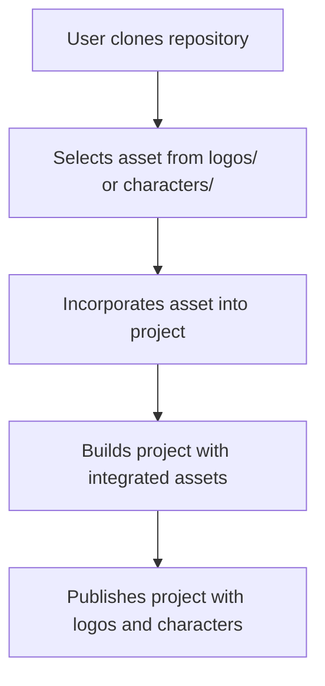

<h1 align="center">🎨 <a href="https://github.com/ronknight/iconic-vault-logo-and-character-repository">Iconic Vault: Logo and Character Repository</a></h1>

<h4 align="center">📁 A repository of iconic logos and character assets for easy access and usage in various projects.</h4>

<p align="center">
<a href="https://twitter.com/PinoyITSolution"></a>
<a href="https://github.com/ronknight?tab=followers"></a>
<a href="https://github.com/ronknight/ronknight/stargazers"></a>
<a href="https://github.com/ronknight/ronknight/network/members"></a>
<a href="https://youtube.com/@PinoyITSolution"></a>
<a href="https://github.com/ronknight/iconic-vault-logo-and-character-repository/issues"></a>
<a href="https://github.com/ronknight/iconic-vault-logo-and-character-repository/blob/master/LICENSE"></a>
<a href="https://github.com/ronknight"></a>
</p>

---

<p align="center">
  <a href="#project-overview">Project Overview</a> •
  <a href="#files">Files</a> •
  <a href="#installation">Installation</a> •
  <a href="#usage">Usage</a> •
  <a href="#api-integration">API Integration</a> •
  <a href="#application-functions">Application Functions</a> •
  <a href="#visualization">Visualization</a> •
  <a href="#disclaimer">Disclaimer</a>
</p>

---

## 📖 Project Overview

The **Iconic Vault: Logo and Character Repository** is a comprehensive web application for managing logos and character assets. It features a pluggable API system that allows you to search and import characters from various entertainment APIs, manage brand logos, and organize your media assets in one centralized location.

### ✨ Key Features
- 🔍 **Multi-API Character Search**: Search characters from Disney, Marvel, and other entertainment APIs
- 🏷️ **Brand Logo Management**: Upload, search, and manage brand logos with Brandfetch integration
- 🔧 **Pluggable API System**: Easily add new APIs through the web interface (no coding required)
- 📊 **Admin Dashboard**: Manage APIs, configure keys, and monitor system status
- 📱 **Responsive Web Interface**: Clean, modern UI for easy asset management
- 📤 **Bulk Import/Export**: Excel/CSV support for bulk operations
- 🖼️ **Image Optimization**: Automatic image downloading and local storage

## 📂 Files

The repository includes the following key files and directories:

- `logos/`: Contains a variety of iconic logos in SVG and PNG formats.
- `characters/`: A collection of character illustrations in vector and raster formats.
- `README.md`: Documentation of the repository.
- `LICENSE`: The repository's license (MIT).
- `app.py`: The main Flask application that handles routes, API calls, and data processing.
- `brandfetch.py`: Functions to interact with Brandfetch API for fetching logos.
- `marvel.py`: Functions to interact with the Marvel API for fetching character information.
- `disney.py`: Functions to interact with the Disney API for fetching character information.
- `brands.json`: JSON file for storing metadata of uploaded logos.
- `characters.json`: JSON file for storing metadata of uploaded characters.
- `templates/`: Contains HTML templates for the web application UI.

## ⚙️ Installation

To use the assets in this repository, follow these steps:

1. Clone the repository to your local machine:
   ```bash
   git clone https://github.com/ronknight/iconic-vault-logo-and-character-repository.git
   ```
2. Navigate to the project directory:
   ```bash
   cd iconic-vault-logo-and-character-repository
   ```

3. Install the required dependencies:
   ```bash
   pip install -r requirements.txt
   ```

4. Set up environment variables by creating a `.env` file with the following content:
   ```
   SECRET_KEY=your_secret_key
   MARVEL_PUBLIC_KEY=your_marvel_public_key
   MARVEL_PRIVATE_KEY=your_marvel_private_key
   ```

5. Run the Flask application:
   ```bash
   python app.py
   ```

6. Open the app in your browser at `http://localhost:5000`.

## 🚀 Usage

### Getting Started
1. **Start the Application**: Run `python app.py` and visit `http://localhost:5000`
2. **Admin Setup**: Visit `/admin` to configure API keys and manage API services
3. **Explore Features**: Use the navigation menu to access different sections

### Managing Logos
1. Navigate to `/logos` to manage brand logos.
2. Upload a logo manually or via an Excel file.
3. Search for logos, download, or delete them.
4. Use Brandfetch integration for automatic logo fetching.

### Managing Characters
1. Navigate to `/characters` to manage licensed characters.
2. Search characters from configured APIs (Disney, Marvel, Fandom, etc.).
3. Add characters to the repository or manage saved characters.
4. Use checkboxes to select which APIs to search from.

### API Management (Admin Panel)
1. Navigate to `/admin` to access the API management dashboard.
2. **Configure API Keys**: Set up authentication keys for various APIs.
3. **Add New APIs**: Dynamically add new API services without coding.
4. **Monitor Status**: View which APIs are available vs. missing keys.
5. **Manage APIs**: Enable/disable or remove API configurations.

## 🔌 API Integration

### Currently Supported APIs

| API | Type | Status | Key Required |
|-----|------|--------|--------------|
| Disney API | Characters | ✅ Active | No |
| Marvel API | Characters | ✅ Active | Yes (Public/Private Key) |
| Fandom API | Characters | ✅ Active | No |
| Brandfetch | Logos | ✅ Active | Yes (API Key) |

### Adding New APIs
Use the `/admin` interface to add new APIs:
1. Go to Admin → Add New API
2. Fill in: API ID, Display Name, Module Path, Function Name, Required Keys
3. Configure API keys in the Keys Configuration section
4. The API will be automatically available in character search

### Suggested Free Public APIs

#### 🎭 Character/Media APIs
| API | Description | Base URL | Key Required |
|-----|-------------|----------|--------------|
| **SWAPI** (Star Wars) | Star Wars characters, films, planets | `https://swapi.dev/api/` | No |
| **Rick and Morty API** | Characters from Rick and Morty | `https://rickandmortyapi.com/api/` | No |
| **Pokemon API** | Pokemon characters and data | `https://pokeapi.co/api/v2/` | No |
| **Harry Potter API** | Harry Potter characters | `https://hp-api.herokuapp.com/api/` | No |
| **Breaking Bad API** | Breaking Bad characters | `https://www.breakingbadapi.com/api/` | No |
| **Game of Thrones API** | GoT characters | `https://anapioficeandfire.com/api/` | No |
| **The Movie Database** | Movies, TV shows, actors | `https://api.themoviedb.org/3/` | Yes (Free tier) |

#### 🎬 TV & Movie APIs
| API | Description | Base URL | Key Required |
|-----|-------------|----------|--------------|
| **TVMaze** | TV shows, episodes, cast | `https://api.tvmaze.com/` | No |
| **TVDB** | The TV Database | `https://api.thetvdb.com/` | Yes (Free) |
| **OMDB** | Open Movie Database | `https://www.omdbapi.com/` | Yes (Free tier) |
| **Trakt.tv** | TV/movies with ratings | `https://api.trakt.tv/` | Yes (Free) |
| **FanArt.tv** | Movie/TV posters & artwork | `https://webservice.fanart.tv/` | Yes (Free) |
| **JustWatch** | Streaming availability | `https://apis.justwatch.com/` | No |
| **MovieGlu** | Cinema listings & movies | `https://api.movieglu.com/` | Yes (Free tier) |
| **IMDb-API** | IMDb movie data | `https://imdb-api.com/` | Yes (Free tier) |

#### 🎨 Logo/Brand APIs
| API | Description | Key Required |
|-----|-------------|--------------|
| **Clearbit Logo API** | Company logos | Yes (Free tier) |
| **Logo.dev** | Brand logos and icons | Yes (Free tier) |
| **Brandsoftheworld** | Brand logo database | Limited free access |

#### 🖼️ Image/Stock Photo APIs
| API | Description | Key Required |
|-----|-------------|--------------|
| **Unsplash API** | Free stock photos | Yes (Free tier) |
| **Pexels API** | Free stock photos | Yes (Free tier) |
| **Pixabay API** | Free images and videos | Yes (Free tier) |

#### 🎵 Entertainment APIs
| API | Description | Key Required |
|-----|-------------|--------------|
| **Last.fm API** | Music artists and albums | Yes (Free tier) |
| **MusicBrainz API** | Music metadata | No |
| **Open Library API** | Book covers and data | No |

### Example: Adding SWAPI (Star Wars)

1. **Create API Module** (`apis/swapi.py`):
```python
import requests

def fetch_starwars_character(character_name):
    try:
        # Search people endpoint
        url = f"https://swapi.dev/api/people/?search={character_name}"
        response = requests.get(url)
        if response.status_code == 200:
            data = response.json()
            results = {}
            for person in data.get('results', []):
                if character_name.lower() in person['name'].lower():
                    # Get character image (you might need to map to actual images)
                    results[person['name']] = f"https://starwars-visualguide.com/assets/img/characters/{person['url'].split('/')[-2]}.jpg"
            return results
    except Exception as e:
        print(f"SWAPI error: {e}")
    return {}
```

2. **Add via Admin Interface**:
   - API ID: `swapi`
   - Display Name: `Star Wars API`
   - Module: `apis.swapi`
   - Function: `fetch_starwars_character`
   - Keys: (leave empty)

3. **Configure**: No API key needed for SWAPI

### Example: Adding Unsplash for Stock Photos

1. **Create API Module** (`apis/unsplash.py`):
```python
import requests
import os

UNSPLASH_ACCESS_KEY = os.getenv('UNSPLASH_ACCESS_KEY')

def search_unsplash_images(query):
    try:
        url = "https://api.unsplash.com/search/photos"
        params = {
            'query': query,
            'per_page': 10,
            'orientation': 'landscape'
        }
        headers = {'Authorization': f'Client-ID {UNSPLASH_ACCESS_KEY}'}
        response = requests.get(url, params=params, headers=headers)

        if response.status_code == 200:
            data = response.json()
            results = {}
            for photo in data.get('results', []):
                results[photo['alt_description'] or f"Unsplash {query}"] = photo['urls']['regular']
            return results
    except Exception as e:
        print(f"Unsplash error: {e}")
    return {}
```

2. **Add via Admin Interface**:
   - API ID: `unsplash`
   - Display Name: `Unsplash Stock Photos`
   - Module: `apis.unsplash`
   - Function: `search_unsplash_images`
   - Keys: `UNSPLASH_ACCESS_KEY`

3. **Configure**: Get free API key from [Unsplash Developers](https://unsplash.com/developers)

### Example: Adding TMDB (The Movie Database)

1. **Create API Module** (`apis/tmdb.py`):
```python
import requests
import os

TMDB_API_KEY = os.getenv('TMDB_API_KEY')
TMDB_BASE_URL = "https://api.themoviedb.org/3"
TMDB_IMAGE_BASE = "https://image.tmdb.org/t/p/w500"

def search_tmdb_people(query):
    """Search for actors/actresses from movies and TV shows"""
    try:
        url = f"{TMDB_BASE_URL}/search/person"
        params = {
            'api_key': TMDB_API_KEY,
            'query': query,
            'include_adult': False
        }
        response = requests.get(url, params=params)

        if response.status_code == 200:
            data = response.json()
            results = {}

            for person in data.get('results', []):
                if person.get('profile_path'):
                    # Check if they have notable movie/TV credits
                    person_id = person['id']
                    credits_url = f"{TMDB_BASE_URL}/person/{person_id}/combined_credits"
                    credits_response = requests.get(credits_url, params={'api_key': TMDB_API_KEY})

                    if credits_response.status_code == 200:
                        credits_data = credits_response.json()
                        total_credits = len(credits_data.get('cast', []))

                        if total_credits > 0:  # Only include if they have credits
                            image_url = f"{TMDB_IMAGE_BASE}{person['profile_path']}"
                            results[f"{person['name']} (Actor)"] = image_url

            return results
    except Exception as e:
        print(f"TMDB error: {e}")
    return {}
```

2. **Add via Admin Interface**:
   - API ID: `tmdb`
   - Display Name: `The Movie Database`
   - Module: `apis.tmdb`
   - Function: `search_tmdb_people`
   - Keys: `TMDB_API_KEY`

3. **Configure**: Get free API key from [TMDB API](https://www.themoviedb.org/settings/api)

### Example: Adding TVMaze for TV Characters

1. **Create API Module** (`apis/tvmaze.py`):
```python
import requests

def search_tvmaze_characters(query):
    """Search for TV show characters"""
    try:
        # First search for shows
        search_url = f"https://api.tvmaze.com/search/shows?q={query}"
        response = requests.get(search_url)

        if response.status_code == 200:
            shows_data = response.json()
            results = {}

            for show_item in shows_data[:5]:  # Limit to first 5 shows
                show = show_item.get('show', {})
                show_id = show.get('id')

                if show_id:
                    # Get cast for this show
                    cast_url = f"https://api.tvmaze.com/shows/{show_id}/cast"
                    cast_response = requests.get(cast_url)

                    if cast_response.status_code == 200:
                        cast_data = cast_response.json()

                        for cast_member in cast_data[:3]:  # Limit to top 3 cast per show
                            person = cast_member.get('person', {})
                            character = cast_member.get('character', {})

                            if person.get('image') and character.get('image'):
                                char_name = character.get('name', '')
                                person_name = person.get('name', '')

                                if char_name and query.lower() in char_name.lower():
                                    image_url = character['image'].get('medium') or character['image'].get('original')
                                    if image_url:
                                        results[f"{char_name} ({person_name}) - {show.get('name', '')}"] = image_url

            return results
    except Exception as e:
        print(f"TVMaze error: {e}")
    return {}
```

2. **Add via Admin Interface**:
   - API ID: `tvmaze`
   - Display Name: `TVMaze TV Shows`
   - Module: `apis.tvmaze`
   - Function: `search_tvmaze_characters`
   - Keys: (leave empty)

3. **Configure**: No API key needed for TVMaze

### Example: Adding OMDB for Movie Characters

1. **Create API Module** (`apis/omdb.py`):
```python
import requests
import os

OMDB_API_KEY = os.getenv('OMDB_API_KEY')

def search_omdb_movie_characters(query):
    """Search for movie characters via OMDB"""
    try:
        # First search for movies
        search_url = "https://www.omdbapi.com/"
        search_params = {
            'apikey': OMDB_API_KEY,
            's': query,
            'type': 'movie'
        }

        response = requests.get(search_url, params=search_params)

        if response.status_code == 200:
            data = response.json()

            if data.get('Response') == 'True':
                results = {}

                for movie in data.get('Search', [])[:3]:  # Limit to 3 movies
                    imdb_id = movie.get('imdbID')

                    # Get detailed movie info
                    detail_params = {
                        'apikey': OMDB_API_KEY,
                        'i': imdb_id,
                        'plot': 'short'
                    }

                    detail_response = requests.get(search_url, params=detail_params)

                    if detail_response.status_code == 200:
                        movie_data = detail_response.json()

                        if movie_data.get('Response') == 'True':
                            # OMDB doesn't have character images, but we can use movie posters
                            poster = movie_data.get('Poster')
                            if poster and poster != 'N/A':
                                title = movie_data.get('Title', '')
                                actors = movie_data.get('Actors', '')

                                # Create entries for main actors
                                for actor in actors.split(', ')[:2]:  # Top 2 actors
                                    if actor and actor != 'N/A':
                                        results[f"{actor} - {title}"] = poster

                return results
    except Exception as e:
        print(f"OMDB error: {e}")
    return {}
```

2. **Add via Admin Interface**:
   - API ID: `omdb`
   - Display Name: `OMDB Movies`
   - Module: `apis.omdb`
   - Function: `search_omdb_movie_characters`
   - Keys: `OMDB_API_KEY`

3. **Configure**: Get free API key from [OMDB API](https://www.omdbapi.com/apikey.aspx)

## 📜 Application Functions

### `app.py`
This is the main file that contains routes and logic for handling logo and character management.

- **Key Functions**:
    - `download_image(image_url, character_name)`: Downloads an image of a logo or character and stores it in the appropriate folder.
    - `logos_page()`: Displays the page for managing brand logos.
    - `characters_page()`: Handles searching for characters via Disney and Marvel APIs, and managing existing characters in the repository.
    - `add_character()`: Adds a character from the search results to the repository.
    - `delete_character()`: Deletes a character from the repository.
    - `upload_excel()`: Processes an Excel file to bulk upload brand logos.
    - `upload_characters_excel()`: Processes an Excel file to bulk upload characters.

### `marvel.py`
This file contains functions to interact with the Marvel API.

- **Key Functions**:
    - `fetch_marvel_character(character_name)`: Fetches character data from Marvel based on the character's name.

### `disney.py`
This file contains functions to interact with the Disney API.

- **Key Functions**:
    - `fetch_disney_character(character_name)`: Fetches character data from Disney based on the character's name.

### `brandfetch.py`
This file interacts with the Brandfetch API to download logos.

- **Key Functions**:
    - `search_and_download_logo(brand_name, download_path, brand_domain)`: Searches for and downloads a high-quality logo for a brand.

## 📊 Visualization

Here's a basic flow of how assets from this repository can be utilized in a project:



## ⚠️ Disclaimer

This repository provides assets under the MIT License. Make sure to review and comply with the license terms when using the assets. Additionally, ensure that the logos and characters are used appropriately, without violating any intellectual property rights.
