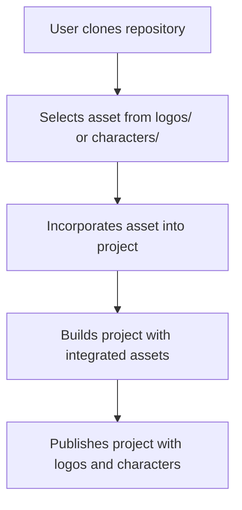

<h1 align="center">🎨 <a href="https://github.com/ronknight/iconic-vault-logo-and-character-repository">Iconic Vault: Logo and Character Repository</a></h1>

<h4 align="center">📁 A repository of iconic logos and character assets for easy access and usage in various projects.</h4>

<p align="center">
<a href="https://twitter.com/PinoyITSolution"></a>
<a href="https://github.com/ronknight?tab=followers"></a>
<a href="https://github.com/ronknight/ronknight/stargazers"></a>
<a href="https://github.com/ronknight/ronknight/network/members"></a>
<a href="https://youtube.com/@PinoyITSolution"></a>
<a href="https://github.com/ronknight/iconic-vault-logo-and-character-repository/issues"></a>
<a href="https://github.com/ronknight/iconic-vault-logo-and-character-repository/blob/master/LICENSE"></a>
<a href="https://github.com/ronknight"></a>
</p>

---

<p align="center">
  <a href="#project-overview">Project Overview</a> •
  <a href="#files">Files</a> •
  <a href="#installation">Installation</a> •
  <a href="#usage">Usage</a> •
  <a href="#application-functions">Application Functions</a> •
  <a href="#visualization">Visualization</a> •
  <a href="#disclaimer">Disclaimer</a>
</p>

---

## 📖 Project Overview

The **Iconic Vault: Logo and Character Repository** is a collection of various logos and character assets designed for use in diverse digital projects. It allows for easy access to high-quality graphic assets that can be integrated into websites, applications, and more.

## 📂 Files

The repository includes the following key files and directories:

- `logos/`: Contains a variety of iconic logos in SVG and PNG formats.
- `characters/`: A collection of character illustrations in vector and raster formats.
- `README.md`: Documentation of the repository.
- `LICENSE`: The repository's license (MIT).
- `app.py`: The main Flask application that handles routes, API calls, and data processing.
- `brandfetch.py`: Functions to interact with Brandfetch API for fetching logos.
- `marvel.py`: Functions to interact with the Marvel API for fetching character information.
- `disney.py`: Functions to interact with the Disney API for fetching character information.
- `brands.json`: JSON file for storing metadata of uploaded logos.
- `characters.json`: JSON file for storing metadata of uploaded characters.
- `templates/`: Contains HTML templates for the web application UI.

## ⚙️ Installation

To use the assets in this repository, follow these steps:

1. Clone the repository to your local machine:
   ```bash
   git clone https://github.com/ronknight/iconic-vault-logo-and-character-repository.git
   ```
2. Navigate to the project directory:
   ```bash
   cd iconic-vault-logo-and-character-repository
   ```

3. Install the required dependencies:
   ```bash
   pip install -r requirements.txt
   ```

4. Set up environment variables by creating a `.env` file with the following content:
   ```
   SECRET_KEY=your_secret_key
   MARVEL_PUBLIC_KEY=your_marvel_public_key
   MARVEL_PRIVATE_KEY=your_marvel_private_key
   ```

5. Run the Flask application:
   ```bash
   python app.py
   ```

6. Open the app in your browser at `http://localhost:5000`.

## 🚀 Usage

### Managing Logos
1. Navigate to `/logos` to manage brand logos.
2. Upload a logo manually or via an Excel file.
3. Search for logos, download, or delete them.

### Managing Characters
1. Navigate to `/characters` to manage licensed characters.
2. Search characters from Disney or Marvel API.
3. Add characters to the repository or manage saved characters.

## 📜 Application Functions

### `app.py`
This is the main file that contains routes and logic for handling logo and character management.

- **Key Functions**:
    - `download_image(image_url, character_name)`: Downloads an image of a logo or character and stores it in the appropriate folder.
    - `logos_page()`: Displays the page for managing brand logos.
    - `characters_page()`: Handles searching for characters via Disney and Marvel APIs, and managing existing characters in the repository.
    - `add_character()`: Adds a character from the search results to the repository.
    - `delete_character()`: Deletes a character from the repository.
    - `upload_excel()`: Processes an Excel file to bulk upload brand logos.
    - `upload_characters_excel()`: Processes an Excel file to bulk upload characters.

### `marvel.py`
This file contains functions to interact with the Marvel API.

- **Key Functions**:
    - `fetch_marvel_character(character_name)`: Fetches character data from Marvel based on the character's name.

### `disney.py`
This file contains functions to interact with the Disney API.

- **Key Functions**:
    - `fetch_disney_character(character_name)`: Fetches character data from Disney based on the character's name.

### `brandfetch.py`
This file interacts with the Brandfetch API to download logos.

- **Key Functions**:
    - `search_and_download_logo(brand_name, download_path, brand_domain)`: Searches for and downloads a high-quality logo for a brand.

## 📊 Visualization

Here's a basic flow of how assets from this repository can be utilized in a project:



## ⚠️ Disclaimer

This repository provides assets under the MIT License. Make sure to review and comply with the license terms when using the assets. Additionally, ensure that the logos and characters are used appropriately, without violating any intellectual property rights.