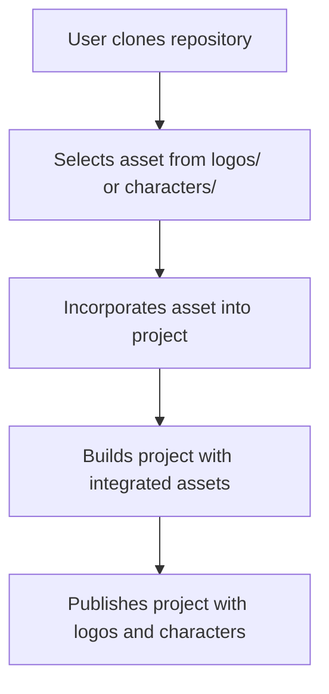

<h1 align="center">🎨 <a href="https://github.com/ronknight/iconic-vault-logo-and-character-repository">Iconic Vault: Logo and Character Repository</a></h1>

<h4 align="center">📁 A repository of iconic logos and character assets for easy access and usage in various projects.</h4>

<p align="center">
<a href="https://twitter.com/PinoyITSolution"></a>
<a href="https://github.com/ronknight?tab=followers"></a>
<a href="https://github.com/ronknight/ronknight/stargazers"></a>
<a href="https://github.com/ronknight/ronknight/network/members"></a>
<a href="https://youtube.com/@PinoyITSolution"></a>
<a href="https://github.com/ronknight/iconic-vault-logo-and-character-repository/issues"></a>
<a href="https://github.com/ronknight/iconic-vault-logo-and-character-repository/blob/master/LICENSE"></a>
<a href="https://github.com/ronknight"></a>
</p>

---

<p align="center">
  <a href="#project-overview">Project Overview</a> •
  <a href="#files">Files</a> •
  <a href="#installation">Installation</a> •
  <a href="#usage">Usage</a> •
  <a href="#application-functions">Application Functions</a> •
  <a href="#visualization">Visualization</a> •
  <a href="#disclaimer">Disclaimer</a>
</p>

---

## 📖 Project Overview

The **Iconic Vault: Logo and Character Repository** is a collection of various logos and character assets designed for use in diverse digital projects. It allows for easy access to high-quality graphic assets that can be integrated into websites, applications, and more.

## 📂 Files

The repository includes the following key files and directories:

- `logos/`: Contains a variety of iconic logos in SVG and PNG formats.
- `characters/`: A collection of character illustrations in vector and raster formats.
- `README.md`: Documentation of the repository.
- `LICENSE`: The repository's license (MIT).

## ⚙️ Installation

To use the assets in this repository, follow these steps:

1. Clone the repository to your local machine:
   ```bash
   git clone https://github.com/ronknight/iconic-vault-logo-and-character-repository.git
   ```
2. Navigate to the project directory:
   ```bash
   cd iconic-vault-logo-and-character-repository
   ```

3. You can now use the logos and character assets in your own projects.

## 🚀 Usage

1. Choose the desired asset from the `logos` or `characters` directory.
2. Copy the asset to your project folder.
3. Integrate the asset into your design or development project.

Example usage of an SVG logo in an HTML file:
```html

```

## 📜 Application Functions

The `app.py` file contains key functionalities for managing the logos in this repository. Here's a summary of the main functions:

1. **File Handling Functions**:
    - `save_uploaded_file(file, brand_name)`: Saves an uploaded file and updates the brand data.
    - `search_and_download_logo(brand_name, download_path, brand_domain=None)`: Uses Brandfetch API to download logos for a brand.
    - `uploaded_file(filename)`: Serves the requested logo image.
    - `download_logo(filename)`: Provides a downloadable version of the logo.
    - `delete_logo(filename)`: Deletes a logo file and updates the brand list.

2. **Route Functions**:
    - `upload_file()`: Handles manual logo uploads.
    - `upload_excel()`: Processes an Excel file with brand names and domains to bulk download logos.
    - `index_page()`, `logos_page()`, `characters_page()`: Serve various pages for the web interface.

## 📊 Visualization

Here's a basic flow of how assets from this repository can be utilized in a project:



## ⚠️ Disclaimer

This repository provides assets under the MIT License. Make sure to review and comply with the license terms when using the assets. Additionally, ensure that the logos and characters are used appropriately, without violating any intellectual property rights.
